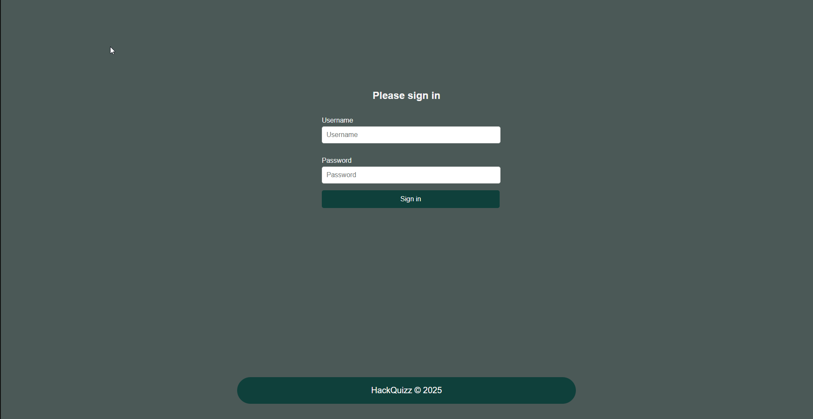
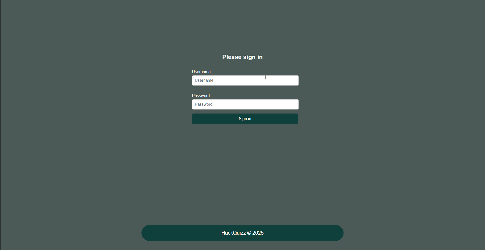

# HackQuizz

HackQuizz is a Java Spring Boot application that offers an engaging platform for users to test their knowledge on various topics through interactive quizzes, allowing them to create and manage their own quizzes.
## How to use 
**Note**: The shown database is already populated with sample data.
<br>Here’s a quick demonstration of the app in action:

### Default user view 



The GIF above illustrates the core features of the quiz app from the user's perspective.

### Admin view 



The GIF above illustrates the core features of the quiz app from the admin's perspective.
## Features

- **User**
  - Secure registration and login system.
  - User credentials stored in the database with encrypted passwords.
  - Default test users for quick access:
    - `admin` / `admin123`
    - `test` / `test123`
  
- **Management**
  - View, create and delete questions.
  - View, Create, update, and delete questions.

- **Interactive Quizzes**
  - A collection of quizzes with styled and intuitive interfaces.
  - Real-time scoring and session tracking.
  - Background styles and views tailored for an engaging experience.

# Database Structure


## Tables

### `app_user`
The `app_user` table stores user information.

| Column Name   | Data Type               | Description                                   |
|---------------|-------------------------|-----------------------------------------------|
| `id`          | bigint (Primary Key)     | Unique identifier for each user. Auto-incremented. |
| `email`       | character varying(255)   | Email address of the user.                   |
| `password`    | character varying(255)   | Encrypted password.                          |
| `role`        | character varying(255)   | Role of the user (e.g., `ROLE_ADMIN`, `ROLE_USER`). |
| `username`    | character varying(255)   | Username of the user.                        |

### `progress`
The `progress` table tracks the user's progress in quizzes or modules.

| Column Name                | Data Type               | Description                                   |
|----------------------------|-------------------------|-----------------------------------------------|
| `id`                        | bigint (Primary Key)     | Unique identifier for progress records. Auto-incremented. |
| `completed_number_of_modules` | integer                | Number of completed modules.                  |
| `general_quiz_topic`        | character varying(255)   | General topic of the quiz.                   |
| `total_number_of_modules`   | integer                 | Total number of modules.                     |
| `user_id`                   | bigint (Foreign Key)     | References `app_user(id)`.                   |

### `question`
The `question` table stores quiz questions and possible answers.

| Column Name      | Data Type               | Description                                   |
|------------------|-------------------------|-----------------------------------------------|
| `id`             | bigint (Primary Key)     | Unique identifier for questions. Auto-incremented. |
| `answera`        | character varying(255)   | Option A.                                     |
| `answerb`        | character varying(255)   | Option B.                                     |
| `answerc`        | character varying(255)   | Option C.                                     |
| `answerd`        | character varying(255)   | Option D.                                     |
| `correct_answer` | character varying(255)   | Correct answer to the question.              |
| `question`       | character varying(255)   | The question text.                           |
| `quiz_id`        | bigint (Foreign Key)     | References `quiz(id)`.                       |

### `quiz`
The `quiz` table stores quiz metadata.

| Column Name   | Data Type               | Description                                   |
|---------------|-------------------------|-----------------------------------------------|
| `id`          | bigint (Primary Key)     | Unique identifier for quizzes. Auto-incremented. |
| `quiz_name`   | character varying(255)   | Name of the quiz.                            |

## Relationships

- **`progress.user_id`** → References `app_user.id`.  
- **`question.quiz_id`** → References `quiz.id`.

## Technologies Used

- **Java Spring Boot**
- **Java Spring Security**
- **Thymeleaf** (for front-end templating)
- **PostgreSQL** (relational database)
- **HTML/CSS** (for styling)

## Installation and Usage

1. Clone the repository:
   ```bash
   git clone https://github.com/yourusername/HackQuizz.git
   cd HackQuizz
   ```

2. Set up the database:
   - Configure database settings in the `application.yaml` file.
   ```yaml
   spring:
    application:
      name: HackQuizz
    datasource:
      url: jdbc:postgresql://localhost:5432/nameOfYourDatabase
      driver-class-name: org.postgresql.Driver
      username: yourusername
      password: password
    jpa:
      properties:
        hibernate:
          dialect: org.hibernate.dialect.PostgreSQLDialect
   ```

3. Build and run the application:
   ```bash
   mvn spring-boot:run
   ```

4. Access the application:
   - Navigate to `http://localhost:8080` in your browser.

5. Log in using the test users:
   - Username: `admin` | Password: `admin123`
   - Username: `test` | Password: `test123`

## Future Plans

- Add more quiz topics and categories.
- Add profile for every user
- Add password remainder

## License

This project is licensed under the [MIT License](LICENSE).

---

